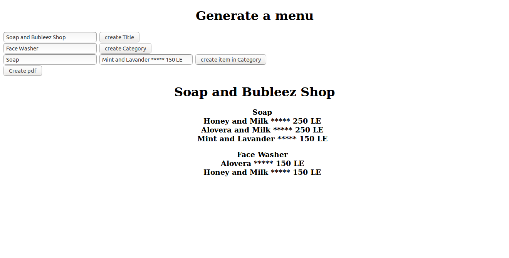

# Capson-Cloud-Devops

In this project I ran EC2 an S3 bucket on AWS and I used IAM roles to access this instance.

First of all, I accessed the instance using this command.  All the names mentioned is just as an example.

```
ssh -i "XXXX.pem" user@ec2-XX-XXX-XX-XXX.us-east-2.compute.amazonaws.com 
```

In this instance, I installed Jenkins by runnig this script script file called install_jenkins.sh

Moreover, I changed the changed the default password and followed the steps here

```https://www.jenkins.io/doc/pipeline/tour/getting-started/```

Install Blue Ocean

```
https://www.jenkins.io/doc/book/blueocean/
```

Restart Jenkins
```
sudo systemctl stop jenkins
sudo systemctl start jenkins
```

Click on blue Ocean to create a pipeline with github

Then click on Create new pipeline with github

```
https://www.jenkins.io/doc/book/blueocean/creating-pipelines/
```

Connect S3 Bucket with AWS
```
https://www.youtube.com/watch?v=ymZSJpAIhnM
https://devops81.com/2020/01/04/uploading-jenkins-artifacts-to-aws-s3/
```

In this project, I created and ran an instance on AWS, configure Jenkins, and create a pipeline to deploy a dynamic website on an AWS S3 bucket. This Project is used to create a dynamic menues and then can be downloaded as a PDF file.

Final result Link

```https://s3.us-east-2.amazonaws.com/nouran.portfolio/generate.html```

To use this website first you can generate a title to your menu. Moreover, you can generate some categories for this menu eg: soft drinks, dessert, etc... Last but not least, append new item on each category by adding a category then the details about this item.



